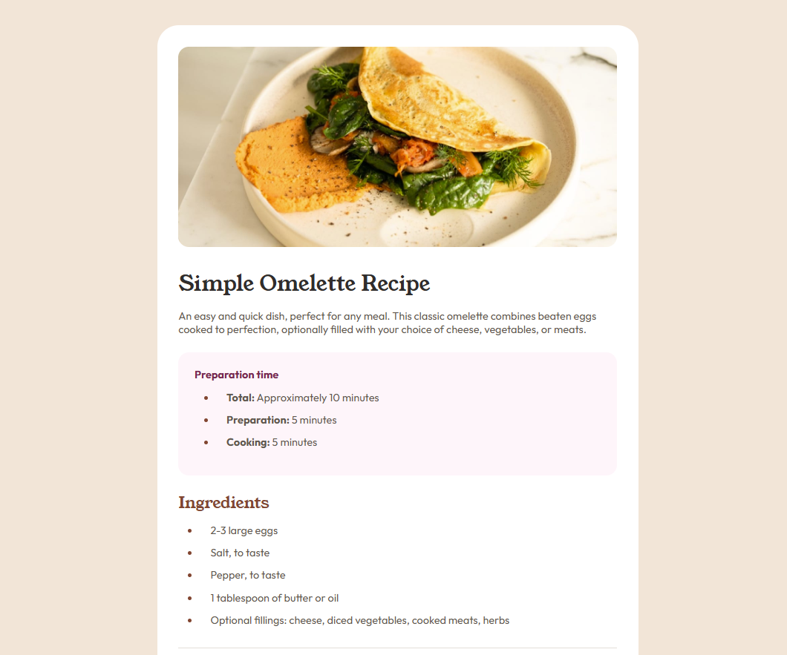
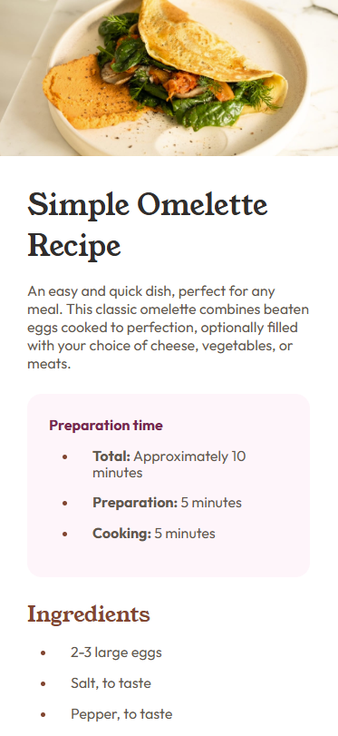

# Frontend Mentor - Recipe page solution

This is a solution to the [Recipe page challenge on Frontend Mentor](https://www.frontendmentor.io/challenges/recipe-page-KiTsR8QQKm). Frontend Mentor challenges help you improve your coding skills by building realistic projects. 

## Table of contents

- [Overview](#overview)
  - [The challenge](#the-challenge)
  - [Screenshot](#screenshot)
  - [Links](#links)
- [Tools used](#tools-used)
  - [What I learned](#what-i-learned)
- [Author](#author)

**Note: Delete this note and update the table of contents based on what sections you keep.**

## Overview

### Screenshot

### Links

- Solution URL: [https://github.com/faisalalmail/CH3-recipe-page](https://github.com/faisalalmail/CH3-recipe-page)
- Live Site URL: [https://ch-3-recipe-page-git-main-faisalalmails-projects.vercel.app/](https://ch-3-recipe-page-git-main-faisalalmails-projects.vercel.app/)

## tools used
- VS code
- Git
- GitHub
- Vercel

### What I learned
I have to say: **This was not an easy one**
On the surface, its an easy project! yes if you were used to webdev and know the best practices, but I am not. 

I created the basic elements of the project in a timely manner I thought I would finish it in one setting, but I later go into the little details of formatting lists and table which I didnt do in the previous challenges.

**I TRIED TO CHEAT**, I looked on frotendmentor for others solutions to figure out why my list text wouldn't indent properly or why the table flows out of the page in a webview, and what I found could not help me solve the issues I had.

Everyone has a different style of implementation, sometimes a little property that you apply could affect the whole result. **lesson leared**

## Author

My name is Faisal - A 35 year old guy from a small island in the middle of the world called Bahrain. I had the passion to code and practiced with html and PHP long ago. I stopped then, but the passion never died. and this could be my way to return.

- Instagram - [Faisal Almail](https://www.instagram.com/faisal.almail)
- Frontend Mentor - [@FaisalAlmail](https://www.frontendmentor.io/profile/faisalalmail)
